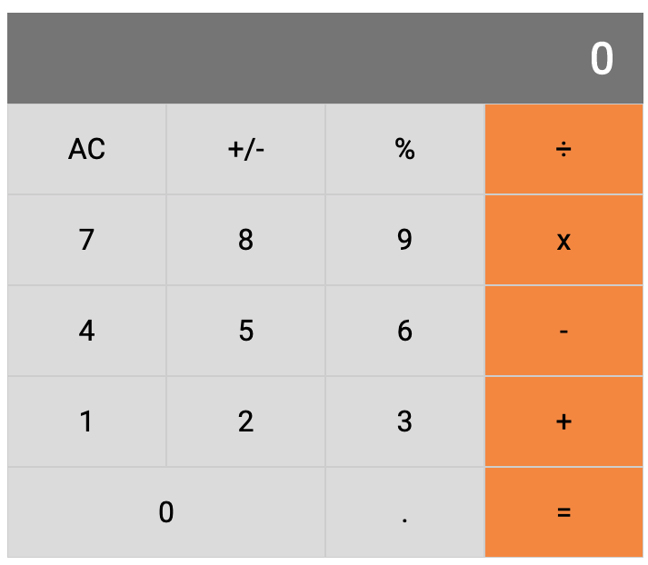

# Calculus - A Microverse educational project

Building a Calculator app using React js

## Built With

-   Create-React-App
-   React JS
-   Heroku
-   Create-react-app-buildpack

## Live Demo

[Live Demo](https://react-calculator-mv-srba.herokuapp.com/)

## Getting Started

- Fork the repository and create a local one on your computer;
- Move to the repository inside the command line using `cd` and the path to the file;
- Run `npm start` on your command line.

## Authors

👤 Santiago Rodriguez
- Github: [@santiagorodriguezbermudez](https://github.com/santiagorodriguezbermudez)
- Twitter: [@srba87](https://twitter.com/srba87)
- Linkedin: [srba87](https://linkedin.com/in/srba)

## 🤝 Contributing

Contributions, issues, and feature requests are welcome!

## 📝 License

This project is [MIT](LICENSE) licensed.